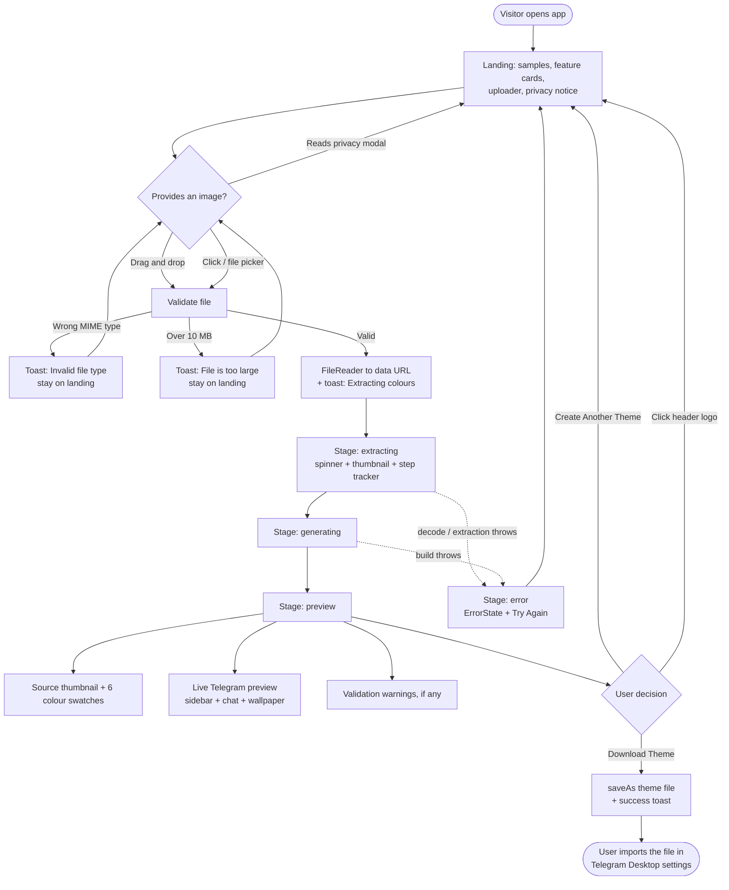
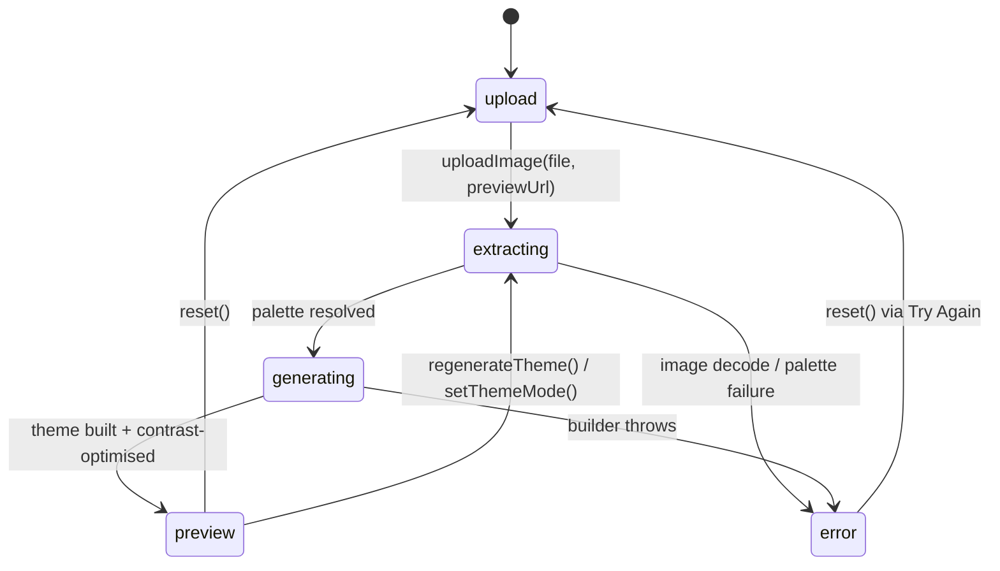
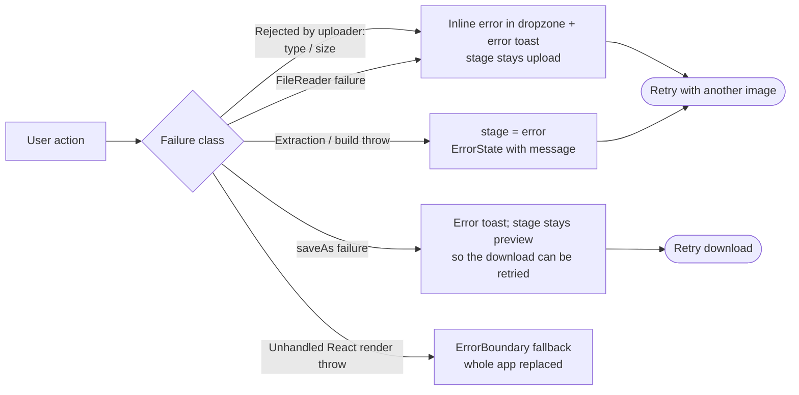

# CLAUDE.md

Guidance for Claude Code (and humans) working in this repository.

## 1. What this project is

**Telegram Theme Generator** is a 100% client-side React SPA that turns any image into a
Telegram Desktop theme file. The user drops in a wallpaper, photo, or artwork; the app
extracts a dominant colour palette in the browser, maps those colours onto ~600 Telegram
Desktop theme properties, nudges text colours until they satisfy WCAG contrast ratios,
renders a live fake-Telegram preview, and offers the resulting theme file as a download.

No backend. No image upload. Every pixel is processed in the browser via Canvas.

- Repo: <https://github.com/Hypovolemic/telegram-theme-generator>
- Licence: MIT
- Hosting: Vercel (see §7)

### Tech stack

| Layer       | Choice                                              |
| ----------- | --------------------------------------------------- |
| UI          | React 19 + TypeScript (strict), function components |
| Build       | Vite 7 (`@vitejs/plugin-react`)                     |
| Styling     | Tailwind CSS 4 (via `@tailwindcss/postcss`)         |
| Colour      | `colorthief` (median-cut palette extraction)        |
| Download    | `file-saver`                                        |
| Tests       | Vitest 3 + Testing Library + jsdom                  |
| Lint/format | ESLint 9 (flat config) + Prettier                   |
| Analytics   | `@vercel/analytics` (see §9 caveat)                 |

State lives in a single React context (`ThemeGeneratorProvider`) — there is no Redux,
Zustand, or router. The whole app is one page driven by a stage machine.

---

## 2. Repository layout

```
src/
├─ App.tsx                       # Page shell: header, hero, sample images, stage switch, footer
├─ main.tsx                      # React root + <Analytics />
├─ context/
│  └─ ThemeGeneratorContext.tsx  # THE ORCHESTRATOR: stage machine + extract→build→optimise pipeline
├─ core/                         # Pure, framework-free logic (the interesting part)
│  ├─ color-extraction/
│  │  └─ ColorExtractor.ts       # Canvas preprocessing, ColorThief palette, vibrancy scoring
│  ├─ contrast/
│  │  ├─ ContrastOptimizer.ts    # WCAG 2.1 ratio maths + binary-search lightness adjustment
│  │  └─ wcag-standards.ts       # AA/AAA thresholds and shared types
│  └─ theme-generation/
│     ├─ TelegramThemeBuilder.ts   # Colour → ~600 Telegram property mapping + file serialisation
│     ├─ ThemeValidator.ts         # Required-property / format / contrast validation
│     └─ templates/base-theme.ts   # THEME_PROPERTIES, REQUIRED_PROPERTIES, light + dark defaults
├─ components/
│  ├─ uploader/ImageUploader.tsx   # Drag-drop + file picker + type/size validation
│  ├─ preview/                     # ThemePreview, MessageList, ChatBubble — the fake Telegram UI
│  ├─ common/                      # DownloadButton, Toast, Spinner, ProgressBar, ProcessingSteps,
│  │                               # Skeleton, ErrorBoundary
│  └─ PrivacyPolicy.tsx            # Privacy modal
└─ utils/
   ├─ file-utils.ts               # Filename sanitising, blob creation, saveAs wrapper
   └─ error-handling.ts           # AppError, error codes, retry, user-friendly messages
```

Every source module has a co-located `*.test.ts(x)` (19 test files). `docs/ARCHITECTURE.md`
and `docs/USER_GUIDE.md` are end-user/contributor docs; this file is the working brief.

---

## 3. Use cases

### UC-1 — Generate a theme from a personal image (primary)

A Telegram Desktop user has a wallpaper or photo they like and wants their chat client to
match it. They drop the image in, glance at the preview, and download the theme file. This
is the only flow that produces an artefact; everything else in the app supports it.

### UC-2 — Evaluate the app before committing an image

A first-time visitor wants to know what the output looks like before uploading anything.
The landing state answers this with two static sample screenshots (`public/sample-chat.png`,
`public/sample-settings.png`) and three feature cards.

### UC-3 — Iterate across candidate images

A user tries several images in a row, comparing extracted palettes and previews, until one
produces a theme they like. "Create Another Theme" resets the stage machine to `upload`
without a page reload.

### UC-4 — Verify the privacy claim

A privacy-conscious user wants to confirm nothing is uploaded. The upload area carries an
expandable "100% Private" notice, and a full privacy modal is reachable from it. Read §9
before touching anything here — the claims and the code do not currently agree.

### UC-5 — Recover from a bad input

The user picks a 40 MB TIFF, a corrupt PNG, or an image that fails to decode. The app must
explain the problem and let them retry without losing the page. Handled at two levels:
`ImageUploader` validation (type/size, pre-pipeline) and the `error` stage
(decode/extraction/generation failures, post-pipeline).

### Non-goals (current)

- Telegram **Android/iOS** `.attheme` binary format — only the Desktop text format is emitted.
- Manual colour editing / palette overrides — the palette is fully derived from the image.
- Accounts, persistence, theme sharing, or server-side anything.
- A dark-mode toggle. `ThemeMode` still exists in `core/` and a full `DEFAULT_DARK_THEME`
  is maintained, but the UI toggle was deliberately removed (see the comments in `App.tsx`)
  and every generated theme is `light`.

---

## 4. User flows

### 4.1 Primary flow — image to theme file



### 4.2 Stage machine

`WorkflowStage` in `src/context/ThemeGeneratorContext.tsx` is the single source of truth for
what the page renders. `App.tsx` switches on it; nothing else should introduce a competing
notion of "what screen are we on".



`regenerateTheme()` and `setThemeMode()` re-enter the pipeline with the retained
`imageFile` / `imagePreviewUrl`. Neither is currently wired to a control in the UI — they
are the extension points for "re-roll the palette" or "dark variant" features.

### 4.3 What happens inside `extracting` → `generating` → `preview`

```
File + object/data URL
        │
        ▼
ColorExtractor.getDominantColors()            src/core/color-extraction/ColorExtractor.ts
  ├─ load image (crossOrigin=anonymous)
  ├─ draw to canvas, longest side capped at maxSize 400   (perf guard)
  ├─ ColorThief.getPalette(img, colorCount=8, quality=10)
  │     └─ on throw → extractFallbackPalette(): manual pixel sampling,
  │        de-duplicated by Euclidean RGB distance < 30
  └─ per colour: hex, brightness (0.299R + 0.587G + 0.114B),
       vibrancy (HSL saturation × mid-lightness preference), then sort by vibrancy desc
        │
        ▼
mapExtractedColorsToThemeColors()             ThemeGeneratorContext.tsx:66
  primary = most vibrant, accent = 2nd most vibrant, color1..6 = top six.
  Backgrounds and text colours are HARDCODED per mode, not derived from the image.
  primaryLight / primaryDark / accentLight = naive ±RGB brightness shift.
        │
        ▼
TelegramThemeBuilder.buildTheme()             src/core/theme-generation/TelegramThemeBuilder.ts
  ├─ map ~14 semantic colours onto hundreds of Telegram property names
  ├─ merge over DEFAULT_LIGHT_THEME / DEFAULT_DARK_THEME so every property is defined
  ├─ serialise as sorted `propertyName: #rrggbb;` lines with a comment header
  └─ ThemeValidator.validate() → errors / warnings surfaced in the preview stage
        │
        ▼
ContrastOptimizer.ensureContrast()            src/core/contrast/ContrastOptimizer.ts
  Applied to exactly FOUR fg/bg pairs (ThemeGeneratorContext.tsx:287):
    windowFg/windowBg, historyTextInFg/msgInBg,
    historyTextOutFg/msgOutBg, dialogsNameFg/dialogsBg
  WCAG 2.1 relative luminance; binary search on lightness, hue preserved; AA (4.5:1).
        │
        ▼
mapThemeToPreviewColors() → <ThemePreview>   +   GeneratedTheme.content → DownloadButton
```

### 4.4 Error-recovery flow



---

## 5. Setup

### Prerequisites

- Node.js 20 or 22 (CI runs both; `package.json` sets no `engines` field)
- npm

### First run

```bash
git clone https://github.com/Hypovolemic/telegram-theme-generator.git
cd telegram-theme-generator
npm install
npm run dev          # http://localhost:5173
```

There are **no environment variables** and no `.env` file. Nothing to configure — if the
dev server starts, the app is fully functional. Vercel Analytics is a no-op locally.

### Scripts

| Script                  | What it does                                           |
| ----------------------- | ------------------------------------------------------ |
| `npm run dev`           | Vite dev server with HMR                               |
| `npm run build`         | `tsc` (project references) then `vite build` → `dist/`  |
| `npm run preview`       | Serve the built `dist/` locally                        |
| `npm test`              | Vitest, single run                                     |
| `npm run test:watch`    | Vitest watch mode                                      |
| `npm run test:coverage` | Vitest + v8 coverage → `coverage/`                     |
| `npm run lint`          | ESLint, `--max-warnings 0`                             |
| `npm run lint:fix`      | ESLint with `--fix`                                    |
| `npm run format`        | Prettier write over `src/**`                           |
| `npm run format:check`  | Prettier check (use this in review, not `format`)      |

### Before pushing

`npm run lint && npm run test:coverage && npm run build` — this is exactly what CI
(`.github/workflows/ci.yml`) runs on Node 20 and 22 for every push and PR to `main`.

Coverage thresholds are enforced at **80%** for branches, functions, lines, and statements
(`vitest.config.ts`). `src/App.tsx`, `src/main.tsx`, and barrel `index.ts` files are
excluded from coverage, so `core/`, `components/`, and `utils/` carry the whole burden —
adding logic to `core/` without tests will fail CI.

---

## 6. Testing conventions

- Co-locate tests: `Foo.tsx` → `Foo.test.tsx` in the same directory.
- `src/test/setup.ts` is the global setup (jest-dom matchers), registered via `setupFiles`.
- `core/` modules are pure and should be tested directly — no rendering, no mocks needed
  beyond a canvas stub.
- Components use Testing Library with `data-testid` hooks that already exist
  (`download-button`, `notification-success`, `error-message`, …). Prefer role/text
  queries; fall back to the existing testids rather than adding new ones.
- Canvas is not implemented in jsdom. Tests touching `ColorExtractor` must stub
  `HTMLCanvasElement.prototype.getContext` / `toDataURL` — follow the established pattern
  in `ColorExtractor.test.ts` rather than inventing another.

---

## 7. Deployment (Vercel)

The app is a static SPA. Vercel's zero-config Vite preset handles it — there is
intentionally **no `vercel.json`** in the repo.

### Build settings

| Setting          | Value           |
| ---------------- | --------------- |
| Framework preset | Vite            |
| Build command    | `npm run build` |
| Output directory | `dist`          |
| Install command  | `npm install`   |
| Node version     | 20.x or 22.x    |
| Env vars         | none            |

### First-time setup (dashboard)

1. Vercel → **Add New… → Project** → import `Hypovolemic/telegram-theme-generator`.
2. Accept the detected **Vite** preset; confirm the table above.
3. **Deploy.** Vercel's GitHub app then wires up automatic deploys.
4. Turn on **Analytics** in the project settings — the `<Analytics />` component in
   `src/main.tsx:10` only reports once the project has Web Analytics enabled.

### Ongoing deploys

- **Production:** every push/merge to `main` deploys to the production domain.
- **Preview:** every PR gets its own preview URL. Use it to eyeball colour-extraction and
  UI changes against real images before merging — the visual output of this app is very
  hard to review from a diff.
- CI and Vercel are independent. A red CI run does **not** block the Vercel deploy, so
  check both before considering a change shipped.

### CLI alternative

```bash
npm i -g vercel
vercel login
vercel          # preview deploy from the current directory
vercel --prod   # production deploy
```

### Deployment notes

- Single entry point, no client-side router → no SPA rewrite rules needed. If a router is
  ever added, a `vercel.json` rewrite of `/(.*)` → `/index.html` becomes mandatory.
- Static assets are served from `public/` at the root: `/sample-chat.png`,
  `/sample-settings.png`. `App.tsx` hides these `` elements on error, so a missing
  asset degrades silently rather than breaking the landing page — verify the deployed page
  visually, not just for a 200.
- `dist/` is gitignored and rebuilt by Vercel; never commit it.

---

## 8. Conventions

- **Branches:** `<area>/<short-topic>`, e.g. `algo/colour-thief`, `ui-ux/beautify`,
  `bug/basic-ui-ux`, `mvp/vercel`, `set-up/tailwind`. Work happens on a branch and lands on
  `main` via PR (`.github/PULL_REQUEST_TEMPLATE.md`).
- **Commits:** short imperative subjects ("Add privacy notice", "Resolve UI bugs"). The
  history is not Conventional Commits; match what is there.
- **Spelling:** user-facing copy uses British English ("colours") while identifiers use
  American English (`ColorExtractor`, `color1`). Keep both as they are.
- **Types:** no `any`. Public functions and exported interfaces carry TSDoc; follow the
  existing density rather than adding or stripping comments wholesale.
- **Styling:** Tailwind utility classes. `App.tsx` additionally uses a `THEME_COLORS`
  object with inline styles for the site's own palette — if you touch site chrome, extend
  `THEME_COLORS` rather than scattering new hex literals.
- **Barrels:** each feature directory has an `index.ts`. Import from the barrel
  (`from './components'`), not from deep paths.

---

## 9. Known issues and inconsistencies

Read this before "fixing" something that looks wrong — several of these are deliberate, and
one is a genuine contradiction that needs a product decision.

1. **File extension mismatch (user-visible).** The download button is labelled
   "Download Theme (.attheme)" (`App.tsx`) and the README/docs say `.attheme`, but the file
   actually written is `.tdesktop-theme` (`src/utils/file-utils.ts:6`). Both are real
   Telegram formats — `.tdesktop-theme` is the Desktop text format the builder emits;
   `.attheme` is the Android format. **The code is right and the labels are wrong.** Fix the
   copy, not the extension, unless the goal is genuinely to add Android support.

2. **Privacy claim vs. Vercel Analytics.** `PrivacyPolicy.tsx` states "No data collection,
   tracking, or analytics" and lists "Cookies or tracking data" among what is not collected,
   and `docs/ARCHITECTURE.md` says "No cookies, analytics, or external requests". But
   `src/main.tsx:10` mounts `<Analytics />`, which sends pageview beacons to Vercel. The
   image-processing privacy claim remains true (nothing leaves the device); the blanket
   "no analytics" claim does not. Either drop the component or correct the copy — do not
   leave the deployed app asserting something false.

3. **Dark mode is unreachable.** `ThemeMode`, `DEFAULT_DARK_THEME`, and `setThemeMode()`
   are complete and tested, but no UI exposes them, so `themeMode` is always `'light'`.
   The toggle was removed on purpose. Do not delete the dark path — it is the foundation
   for the feature returning.

4. **Backgrounds ignore the image.** `mapExtractedColorsToThemeColors()`
   (`ThemeGeneratorContext.tsx:66`) hardcodes every background and text colour per mode and
   uses the extracted palette only for `primary`, `accent`, and `color1..6`. This is the
   single biggest limitation of the current output: two very different images can yield
   near-identical themes. Prime target for the colour-extraction rework.

5. **Contrast optimisation covers four pairs only.** Of the ~600 emitted properties, exactly
   four fg/bg pairs are checked (`ThemeGeneratorContext.tsx:287`). Sidebar, menu, tooltip,
   button, and service-message text are never verified.

6. **`adjustBrightness()` is naive.** It adds a flat offset to each RGB channel, which clips
   and shifts hue on saturated colours. `ContrastOptimizer` already contains proper HSL
   round-tripping with hue preservation — reuse it instead.

7. **`ThemeValidator` contrast checking is off by default.** `checkContrast` defaults to
   `false` and nothing turns it on, so contrast-related validation issues never reach the
   warnings panel.

8. **`coverage/` is committed** (113 tracked files) while `dist/` is ignored. Regenerating
   coverage produces a large, noisy diff. Consider gitignoring it; until then, do not stage
   `coverage/` alongside source changes.

9. **Vercel Analytics in tests.** `src/main.tsx` is excluded from coverage and never
   rendered in tests, so `<Analytics />` is never exercised. Keep it out of component trees
   under test.

---

## 10. Working on this codebase

### Where to make which change

| Goal                                      | Start here                                                             |
| ----------------------------------------- | ---------------------------------------------------------------------- |
| Better / different palette extraction     | `src/core/color-extraction/ColorExtractor.ts`                          |
| Palette → theme colour semantics          | `mapExtractedColorsToThemeColors()` in `ThemeGeneratorContext.tsx`      |
| Which Telegram property gets which colour | `TelegramThemeBuilder.mapColorsToProperties()`                         |
| New Telegram property / new default       | `src/core/theme-generation/templates/base-theme.ts`                    |
| Readability / WCAG behaviour              | `ContrastOptimizer.ts` + the `textBgPairs` list in the context          |
| Preview fidelity                          | `src/components/preview/` (`ThemePreview`, `MessageList`, `ChatBubble`) |
| Upload UX, validation, formats            | `src/components/uploader/` (`types.ts` holds the limits)               |
| Stage/flow changes                        | `ThemeGeneratorContext.tsx` first, then the switch in `App.tsx`         |

### Ground rules

- **Keep `core/` framework-free.** No React imports, no DOM beyond Canvas. That separation
  is what makes the algorithms testable and is worth defending.
- **The context is the only orchestrator.** Components read state and call actions; they do
  not instantiate `ColorExtractor`, `TelegramThemeBuilder`, or `ContrastOptimizer`
  themselves.
- **Every generated theme must stay complete.** The builder merges over a full base theme so
  no property is ever missing. If you add a property to `mapColorsToProperties()`, add its
  default to `base-theme.ts` too.
- **Colour-algorithm changes need visual verification.** Unit tests cannot tell you whether
  a theme looks good. Run the app against several real images — a photo, flat artwork, a
  near-greyscale image, and a single-colour image — before calling it done.
- **Performance guardrails are deliberate:** the `maxSize: 400` downscale and `quality: 10`
  sampling keep extraction responsive on large images. If you change them, measure against
  a 10 MB image (the upload ceiling).
